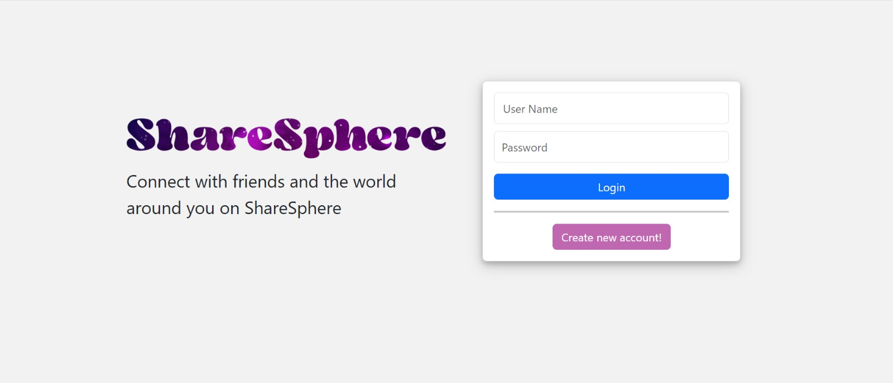
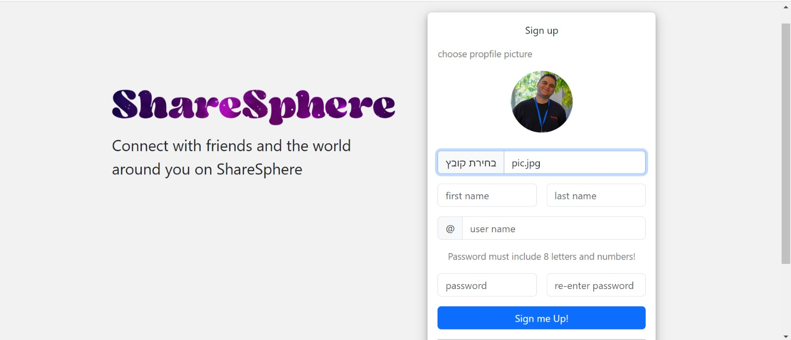
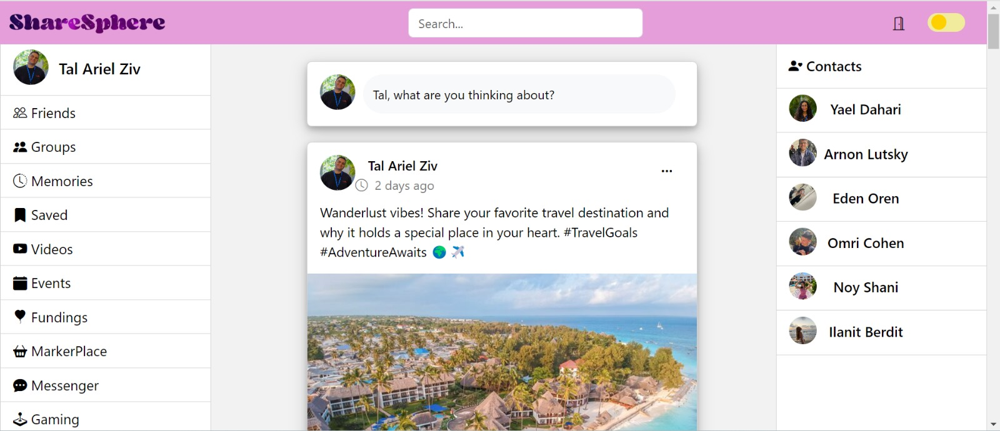

# [The Project's Wiki](https://github.com/Tal144155/Server/wiki)
# ShareSphere

**The Share Sphere App is a social media platform that allows users to share posts and interact with each other. This README file provides an overview of the websites's features and functionalities.**

## running the application

- Download the repository to your computer
- Changeg the directory in terminal to SahreSphere (there has been a typo in the name 😅)
- Install dependencies (for running the app) using **npm install**
- Install react-router-dom by typing **npm install react-router-dom**
- Run the app using **npm start**
- In order to run the tests write **npm test**
- Our suggestion is to login with the user: **user name: tal144155, password: tal2024**, even though it does not matter so much.

## About the app:

The name "ShareSpere" is a fusion of two key concepts: "Share" and "Sphere," each contributing to the essence of our social media platform.

### Share

At ShareSpere, sharing lies at the heart of our community. Whether it's sharing moments, ideas, or experiences, our platform is designed to facilitate seamless sharing among users. Connect with friends, family, and the world by effortlessly exchanging content in an inclusive and engaging environment.

### Sphere

The term "Sphere" brings the idea of a rounded or three-dimensional space. In the context of ShareSpere, it signifies the virtual space where our community thrives. It represents the interconnectedness of our users and the inclusive environment we strive to create.

## App features:

- When opening the ShareSphere website, you are given the opportunity to log in to the website. If you dont have an account, press the button **Create new account!** that will redirect you to the signup page.

- On the signup page, you can create your new account. Please notice: **you must upload your profile pic**, **your full name can only include letters**, **your user name must be unique**, **your password must containt 8 letters and numbers, and match the re-enter password**.

- After signup, you will be able to login and enter the feed page.

- On the feed page you can see all of the posts on ShareSphere. You can add a new post, edit it and delete it. You can also comment on posts, press like and share the post.

- **Please Notice:** you can only edit/delete your posts and comments, not all users posts and comments!

- On the left you will see the menu bar with options that are not yet available, but **try pressing one** and see what happens 😁.

- On the right you will be able to see the right menu bar with all the users on the site (except you), these are your contacts.

- On the top menu you will be able to see the search box and 2 button: **Log Out button** that will redirect you to login page and set the logged-in user, and the **Night Mode button** that will change the theme of the site.

# Pictures from the website:

## Login page

## SignUp page

## Feed page

